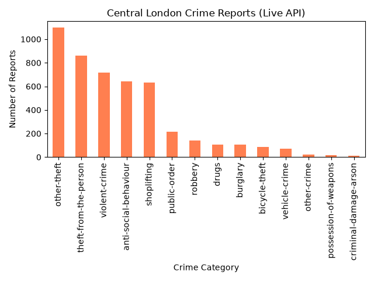

# Live Crime Data Analyser 

A Python-based data analysis tool that connects to the official UK Police API to fetch, process, and visualize live crime data for Central London.

# Overview
This project demonstrates how to connect to web APIs, parse JSON data, and extract real-world insights using data science libraries. 
The script automatically downloads thousands of recent crime reports, calculates the most frequent crime categories using Pandas, and outputs a visual bar chart using Matplotlib.

# Technologies Used
* Python 3
* Requests (HTTP API integration)
* Pandas*(Data cleaning and JSON parsing)
* Matplotlib (Data visualization)

# Visual Output
Here is the automated chart generated from live UK Police data(FROM 16/09/26):

# How to Run
To run this project locally, install the required libraries:
pip install requests pandas matplotlib
python crime_analyser.py
